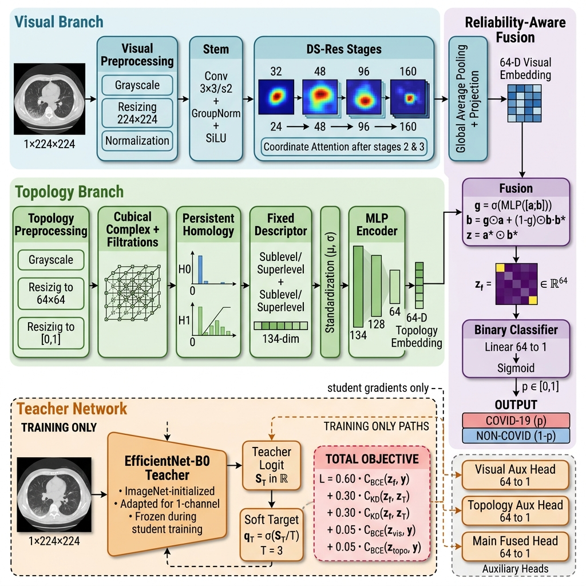

# TopoLite-KD: Topology-Aware Knowledge Distillation for COVID-19 CT Classification

> ### 🚀 **Live Kaggle Notebook (Run Professionally):**
> **[Open Live Experiment on Kaggle &rarr;](https://www.kaggle.com/code/ibadatali/topokd-research-finalv)**

<div align="center">

[](https://www.kaggle.com/code/ibadatali/topokd-research-finalv)
[](LICENSE)
[](https://python.org)
[](https://pytorch.org)
[](https://gudhi.inria.fr)
[]()

<br/>

**Authors:** Ibadat Ali &nbsp;·&nbsp; Shawaiz Ali &nbsp;·&nbsp; Muhammad Abdullah &nbsp;·&nbsp; Muhammad Usama

**Affiliation:** Department of Computer Science, GIFT University, Gujranwala, Pakistan

<br/>

> ⚠️ **Research software only.** Model predictions are **not** clinical diagnoses.

</div>

---

## 🔬 Overview

**TopoLite-KD** is a lightweight, topology-augmented deep learning framework for binary COVID-19/Non-COVID classification from chest CT scans. It fuses:

- **Visual features** — depthwise-separable CNN with Coordinate Attention
- **Topological features** — 134-D cubical persistent homology descriptors (GUDHI)
- **Knowledge Distillation** — frozen EfficientNet-B0 teacher at temperature T = 3

---

## 🚀 Live Experiment on Kaggle

> The complete experiment — training, evaluation, and ablation studies — was run professionally on **Kaggle GPU** and is publicly available:

<div align="center">

### 👉 [https://www.kaggle.com/code/ibadatali/topokd-research-finalv](https://www.kaggle.com/code/ibadatali/topokd-research-finalv)

*Click to open the live Kaggle notebook with full training logs, metrics, and results.*

</div>

**Required dataset:** [SARS-CoV-2 CT-Scan Dataset by Plameneduardo](https://www.kaggle.com/datasets/plameneduardo/sarscov2-ctscan-dataset) — attach to the notebook session before running.

```bash
# Inside the Kaggle notebook environment
cd /kaggle/working/covid_19_fuzzy_integral_CTSCAN
pip install -r requirements.txt
pip install -e .
python scripts/run_pipeline.py --config configs/topolite_kd.yaml --device cuda
```

---

## 🏗️ Architecture

<div align="center">



*Figure 1 — TopoLite-KD full pipeline.*
**(Blue / Top)** Lightweight Visual Branch: Depthwise-Separable CNN + Coordinate Attention → 64-D visual embedding.*
**(Green / Middle)** Topology Branch: Cubical Persistent Homology (GUDHI) → 134-D descriptor → MLP → 64-D topology embedding.*
**(Purple / Right)** Reliability-Aware Fusion: per-feature gate + multiplicative interaction → binary classifier.*
**(Orange / Bottom, dashed)** EfficientNet-B0 Teacher: active during training only, provides soft targets for Knowledge Distillation.*

</div>

### Stage-by-Stage Breakdown

| Stage | Component | Output |
|---|---|---|
| **Input** | Grayscale CT slice | `1 × 224 × 224` |
| **Stem** | Conv 3×3/s2 + GroupNorm + SiLU | `24 ch` |
| **DS-Res Stages** | Depthwise-separable residual blocks | `32 → 48 → 96 → 160 ch` |
| **Coordinate Attention** | Spatial + channel attention (after stages 2 & 3) | injected in-place |
| **Visual Embedding** | Global Avg Pool + Linear | **`64-D`** |
| **Topo Resize** | Grayscale → 64×64 → normalize `[0,1]` | `64 × 64` |
| **Cubical Persistence** | Sublevel + Superlevel filtrations via GUDHI | H0 & H1 barcodes |
| **Fixed Descriptor** | Lifetime statistics + Betti counts | **`134-D`** |
| **Standardization** | Train-split μ/σ fit only — no val/test leakage | `134-D normalized` |
| **MLP Encoder** | 134 → 128 → 64 | **`64-D`** |
| **Reliability-Aware Fusion** | Per-feature gate `g = σ(MLP([a;b]))` + multiplicative blend | **`64-D fused`** |
| **Binary Classifier** | Linear 64→1 + Sigmoid | `p ∈ [0, 1]` |
| **Teacher** *(train only)* | EfficientNet-B0, frozen, temperature `T = 3` | soft targets `q_T` |

**Total trainable parameters: `196,773`**

### Training Objective

```
ℒ = 0.60 · BCE(z_f,    y)    ← main supervised loss on fused head
  + 0.30 · KD(z_f,    z_T)   ← response distillation from EfficientNet-B0 teacher
  + 0.05 · BCE(z_vis,  y)    ← visual auxiliary head
  + 0.05 · BCE(z_topo, y)    ← topology auxiliary head
```

---

## 📋 Method Suite

| Family | Core Method | Status |
|---|---|---|
| Standard CNN + TDA | Conventional CNN + fixed persistent-homology descriptor | ✅ Complete baseline |
| **TopoLite-KD** | DS-CNN + 134-D topology + reliability-aware fusion + EfficientNet-B0 KD | ✅ **Main method** |
| TopoLite-MSF-KD | 144-token multi-scale filtration + H0/H1 Transformers + FiLM | ✅ Complete (negative experiment) |
| TopoLite-FKD-SAM | Response-KD + Feature-KD + Sharpness-Aware Minimization | ✅ Framework complete |
| TopoFM-Slice-v1 | DINOv2 + learnable topology tokens + bidirectional cross-attention | ✅ Slice-level reconstruction |
| A0–A10 Ablations | Visual, topology, fusion, KD, attention, homology, filtration variants | ✅ Full 12-config suite |

---

## 📂 Repository Structure

```
covid_19_fuzzy_integral_CTSCAN/
│
├── covid-19.ipynb                         ← Original fuzzy-integral CNN baseline notebook
├── README.md                              ← This file
├── CITATION.cff                           ← Machine-readable citation
├── CODEBASE_AUDIT.md                      ← Provenance matrix: confirmed / reconstructed / untested
├── LICENSE                                ← Apache License 2.0
├── requirements.txt                       ← Full pinned dependency list
├── topokd_kaggle_requirements.txt         ← Kaggle-specific requirements (torch pre-installed)
├── pyproject.toml                         ← Package build config + CLI entry-points
├── Makefile                               ← install / test / docs / lint shortcuts
│
├── docs/
│   └── architecture.png                   ← Full pipeline architecture diagram (Figure 1 above)
│
├── configs/                               ← YAML experiment configurations
│   ├── base.yaml                          ← Shared defaults: LR, batch size, epochs, paths
│   ├── topolite_kd.yaml                   ← ★ MAIN MODEL: full TopoLite-KD
│   ├── baseline_cnn_tda.yaml              ← Baseline: standard CNN + fixed TDA descriptor
│   ├── topolite_msf_kd.yaml               ← Extended: 144-token multi-scale filtration
│   ├── topolite_fkd_sam.yaml              ← Extension: feature-KD + SAM optimizer
│   ├── topofm_slice_v1.yaml               ← DINOv2 + learnable topology tokens
│   ├── archive_override_template.yaml.example
│   └── ablations/                         ← A0–A10 ablation configs
│       ├── A0_visual_only.yaml            ← No topology branch
│       ├── A1_tda_only.yaml               ← No visual branch
│       ├── A2_concat.yaml                 ← Simple concatenation fusion (no gate)
│       ├── A3_fixed_fusion.yaml           ← Fixed-weight fusion
│       ├── A4_gated_no_kd.yaml            ← Gated fusion, no distillation
│       ├── A5_visual_kd.yaml              ← KD on visual branch only
│       ├── A6_full_topolite_kd.yaml       ← Full model (ablation reference)
│       ├── A7_no_coordinate_attention.yaml
│       ├── A8_h0_only.yaml               ← Topology: connected components only
│       ├── A9_h1_only.yaml               ← Topology: loops only
│       ├── A10_sublevel_only.yaml
│       └── A10_superlevel_only.yaml
│
├── src/topokd/                            ← Core installable Python package
│   ├── cli.py                             ← topokd-train / topokd-evaluate / topokd-infer
│   ├── config.py                          ← Config loader, merger, CLI --set override handler
│   ├── data/                              ← Discovery, SHA-256 hashing, stratified splits, transforms
│   ├── topology/                          ← Cubical PH, 134-D descriptor, 144-token extractor, cache
│   ├── models/                            ← TopoLite, MSF, TopoFM, EfficientNet-B0 teacher, fusion
│   ├── losses/                            ← BCE, response-KD, feature-KD, supervised contrastive loss
│   ├── optim/                             ← AdamW / SGD / SAM wrappers, LR schedulers
│   ├── engine/                            ← Training loop, inference, temperature calibration, eval
│   ├── evaluation/                        ← All metrics, bootstrap CIs, paired McNemar tests
│   ├── visualization/                     ← Loss/metric curves, Grad-CAM, calibration plots
│   └── utils/                             ← Seeds, I/O, logging, checkpoint management, env capture
│
├── scripts/                               ← Runnable CLI scripts
│   ├── run_pipeline.py                    ← ★ ONE-COMMAND end-to-end pipeline
│   ├── prepare_manifest.py                ← Frozen, leakage-audited train/val/test split builder
│   ├── build_tda_cache.py                 ← Precompute topology descriptors + train-only standardizer
│   ├── train_teacher.py                   ← Train EfficientNet-B0 teacher
│   ├── train.py                           ← Train any student model
│   ├── evaluate.py                        ← Evaluate checkpoint on frozen test split
│   ├── visualize.py                       ← Grad-CAM + diagnostic figure generation
│   ├── infer.py                           ← Single-image or folder inference
│   ├── run_ablation_suite.py              ← Run A0–A10 across multiple seeds
│   ├── aggregate_seeds.py                 ← Aggregate multi-seed → mean ± std CSV
│   ├── compare_models.py                  ← McNemar + bootstrap AUROC comparison
│   ├── profile_model.py                   ← Latency, throughput, peak CUDA memory
│   ├── export_paper_tables.py             ← Export LaTeX/CSV tables for paper
│   ├── audit_run.py                       ← Verify all required artifacts in a run dir
│   ├── package_run.py                     ← Archive run with checksums
│   └── validate_install.py               ← Smoke-test (synthetic 32×32, 1 epoch, no GPU needed)
│
├── notebooks/
│   └── Kaggle_Quickstart.ipynb            ← Minimal Kaggle bootstrap notebook
│
├── results/                               ← Generated outputs (git-ignored; populated at runtime)
│   └── [experiment]/seed_[N]/
│       ├── resolved_config.yaml
│       ├── checkpoints/best.pt
│       ├── logs/run.log + history.csv
│       ├── metrics/test_metrics.json
│       ├── predictions/test_predictions.csv
│       └── figures/                       ← ROC, PR, confusion matrix, Grad-CAM, etc.
│
├── research_records/                      ← Author archival records (NOT generated results)
│   └── historical_results.yaml
│
└── artifacts/                             ← Frozen pipeline artifacts
    ├── split_manifest.csv                 ← Frozen train/val/test split (exact reproduction)
    └── teacher_best.pt                    ← Trained EfficientNet-B0 teacher checkpoint
```

---

## 🖥️ Local Setup

### Prerequisites

| Requirement | Version | Notes |
|---|---|---|
| Python | ≥ 3.10 | |
| PyTorch | ≥ 2.2 | CUDA 11.8 or 12.1 recommended |
| GUDHI | ≥ 3.9 | Topological data analysis |
| CUDA GPU | Any | Strongly recommended for training |

### Install

```bash
# Clone the repository
git clone https://github.com/Ibadat-Ali86/covid_19_fuzzy_integral_CTSCAN.git
cd covid_19_fuzzy_integral_CTSCAN

# Create virtual environment
python -m venv .venv
source .venv/bin/activate          # Windows: .venv\Scripts\activate

# Install dependencies
pip install --upgrade pip
pip install -r requirements.txt
pip install -e .

# Smoke-test (no GPU, synthetic data, ~30 seconds)
python scripts/validate_install.py --config configs/topolite_kd.yaml --set data.image_size=32
```

### Dataset Setup

```bash
# Download SARS-CoV-2 CT-Scan Dataset, then:
python scripts/prepare_manifest.py \
  --config configs/topolite_kd.yaml \
  --set data.root=/path/to/sarscov2-ctscan-dataset
```

---

## 🔄 Step-by-Step Reproducible Workflow

### Step 1 — Frozen data split (leakage-audited)

```bash
python scripts/prepare_manifest.py --config configs/topolite_kd.yaml
```

> For **exact paper reproduction**, restore `artifacts/split_manifest.csv` — do not regenerate.

### Step 2 — Precompute topology cache

```bash
python scripts/build_tda_cache.py --config configs/topolite_kd.yaml
```

Computes 134-D descriptors. Fits μ/σ standardizer on **training split only**.

### Step 3 — Train EfficientNet-B0 teacher

```bash
python scripts/train_teacher.py --config configs/topolite_kd.yaml
# → artifacts/teacher_best.pt
```

### Step 4 — Train student model

```bash
# Main method
python scripts/train.py --config configs/topolite_kd.yaml

# Alternatives
python scripts/train.py --config configs/baseline_cnn_tda.yaml
python scripts/train.py --config configs/topolite_msf_kd.yaml
python scripts/train.py --config configs/topolite_fkd_sam.yaml
python scripts/train.py --config configs/topofm_slice_v1.yaml
```

### Step 5 — Evaluate on frozen test split

```bash
python scripts/evaluate.py \
  --config configs/topolite_kd.yaml \
  --checkpoint results/topolite_kd/seed_42/checkpoints/best.pt
```

Temperature scaling and threshold selection are fitted on **validation** predictions only. Test split is evaluated once with those fixed values.

### Step 6 — Grad-CAM explanations

```bash
python scripts/visualize.py \
  --config configs/topolite_kd.yaml \
  --checkpoint results/topolite_kd/seed_42/checkpoints/best.pt
```

### Step 7 — Full ablation matrix (A0–A10)

```bash
python ablation_studies.py \
  --config-dir configs/ablations \
  --seeds 42 1337 2026 3407 9001 \
  --continue-on-error

python scripts/aggregate_seeds.py
python scripts/export_paper_tables.py
```

### Or — run everything at once

```bash
python scripts/run_pipeline.py --config configs/topolite_kd.yaml --device cuda
```

---

## 🧪 Ablation Study Map

| ID | Name | What Is Ablated |
|---|---|---|
| A0 | Visual-only | No topology branch |
| A1 | TDA-only | No visual branch |
| A2 | Concat fusion | No reliability gate; plain concatenation |
| A3 | Fixed fusion | Fixed-weight blend; no learned gate |
| A4 | Gated, no KD | Full gated fusion; no distillation |
| A5 | Visual KD | Distillation on visual branch only |
| **A6** | **Full TopoLite-KD** | **Complete model — ablation reference** |
| A7 | No Coord. Attention | CA modules removed from visual branch |
| A8 | H0 only | Connected components only |
| A9 | H1 only | Loops only |
| A10a | Sublevel only | One filtration direction |
| A10b | Superlevel only | Opposite filtration direction |

---

## 📊 Metrics Computed

| Category | Metrics |
|---|---|
| Classification | Accuracy, Balanced Accuracy, Sensitivity, Specificity, Precision, NPV, F1, MCC, Cohen's κ |
| Error Rates | FPR, FNR, TN, FP, FN, TP |
| Curves | AUROC, AUPRC, ROC, PR, Calibration, Threshold Analysis |
| Calibration | Brier Score, NLL, Expected Calibration Error, Temperature Scaling |
| Efficiency | Parameter count, inference latency, throughput, peak CUDA memory |
| Statistics | Bootstrap 95% CIs, paired McNemar test, paired bootstrap AUROC difference |

---

## 🛡️ Scientific Safeguards

- Test split **never** used for early stopping, calibration, or threshold selection
- SHA-256 duplicate detection — cross-label conflicts halt the pipeline
- TDA standardizer fitted on **training data only** — no val/test leakage
- Teacher checkpoint **mandatory** for KD — random-teacher distillation is blocked
- Cache signatures prevent mismatched topology configs from sharing features
- Historical records (`research_records/`) stored separately from generated outputs

---

## 📋 Pre-Submission Reproduction Checklist

- [ ] `artifacts/split_manifest.csv` (frozen split)
- [ ] `resolved_config.yaml` for each reported run
- [ ] Teacher + student `.pt` checkpoints
- [ ] Topology cache signature + standardizer (`.npz`)
- [ ] `environment.json` + `pip_freeze.txt`
- [ ] All metric JSON files + bootstrap CI files
- [ ] `test_predictions.csv` with per-image SHA-256 hashes
- [ ] Calibration temperature + selected decision threshold
- [ ] All curve PNGs + underlying CSVs
- [ ] Grad-CAM cases (correct, errors, uncertain)
- [ ] Multi-seed mean ± std + paired significance test results

---

## 📦 Dependencies

| Package | Version | Purpose |
|---|---|---|
| `torch` | ≥ 2.2 | Deep learning framework |
| `torchvision` | ≥ 0.17 | Image transforms, EfficientNet |
| `gudhi` | ≥ 3.9 | Cubical persistent homology |
| `numpy` | ≥ 1.26 | Numerical arrays |
| `pandas` | ≥ 2.1 | Metrics, manifests, CSVs |
| `scikit-learn` | ≥ 1.4 | Stratified splits, bootstrap |
| `scipy` | ≥ 1.11 | Statistical tests |
| `matplotlib` | ≥ 3.8 | All figures |
| `opencv-python-headless` | ≥ 4.9 | Image I/O |
| `tensorboard` | ≥ 2.16 | Training visualization |
| `tqdm` | ≥ 4.66 | Progress bars |
| `psutil` | ≥ 5.9 | Resource monitoring |

---

## 📚 References

1. Kundu et al. (2021). *COVID-19 detection from lung CT-scans using a fuzzy integral-based CNN ensemble*. Computers in Biology and Medicine, 138, 104895.
2. Hinton, Vinyals & Dean (2015). *Distilling the Knowledge in a Neural Network*.
3. Hou et al. (2021). *Coordinate Attention for Efficient Mobile Network Design*. CVPR.
4. Foret et al. (2021). *Sharpness-Aware Minimization for Efficiently Improving Generalization*. ICLR.
5. Oquab et al. (2023). *DINOv2: Learning Robust Visual Features without Supervision*.
6. Khosla et al. (2020). *Supervised Contrastive Learning*. NeurIPS.
7. Edelsbrunner et al. (2002). *Topological Persistence and Simplification*.
8. GUDHI Project — Cubical Complexes and Persistent Homology documentation.

---

## ✍️ Citation

```bibtex
@software{ali2026topokd,
  title   = {TopoLite-KD: Topology-Aware Knowledge Distillation for COVID-19 CT Classification},
  author  = {Ali, Ibadat and Ali, Shawaiz and Abdullah, Muhammad and Usama, Muhammad},
  year    = {2026},
  version = {1.0.0},
  license = {Apache-2.0},
  url     = {https://github.com/Ibadat-Ali86/covid_19_fuzzy_integral_CTSCAN},
  note    = {Kaggle experiment: https://www.kaggle.com/code/ibadatali/topokd-research-finalv}
}
```

---

## 📄 License

Apache License 2.0 — see [LICENSE](LICENSE).

---

<div align="center">

**GIFT University · Department of Computer Science · Gujranwala, Pakistan**

[](https://www.kaggle.com/code/ibadatali/topokd-research-finalv)

</div>
